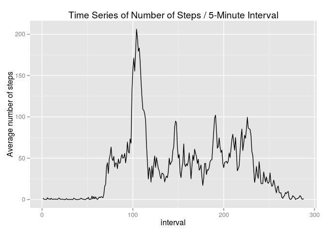
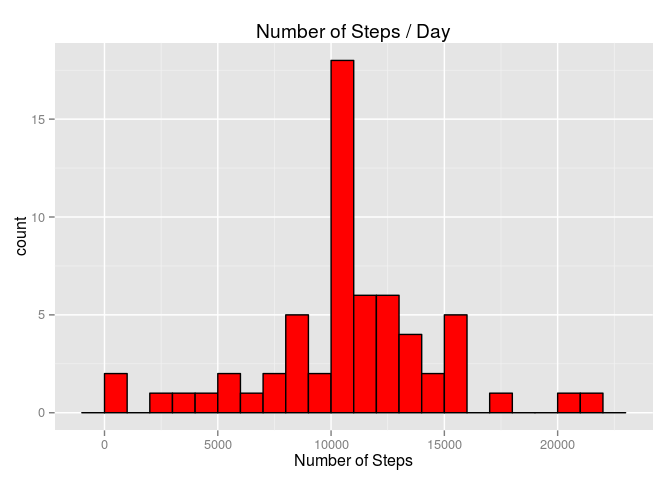
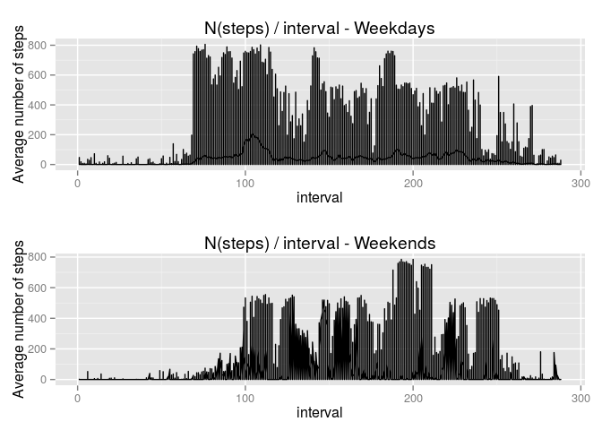

# Reproducible Research: Peer Assessment 1
Chris Klopfenstein  

## Introduction
This assignment asks us to analyze data collected from a personal activity monitoring device. The data consists of measurements of number of steps taken in 5-minute intervals, collected over a 2-month period.

## Loading and preprocessing the data
Read the data from a text (csv) file, and do some preprocessing. The data consist of 288 observations of 3 variables - steps, date, interval - for 61 days. Here the preprocessing consists of 2 steps: (1) convert date values from strings to POSIXct values; (2) convert interval values from input (non-obvious) values to a sequence from 1 .. 288. The values for number of steps include some NA values, which will be dealt with later.


```r
library("data.table")
library("dplyr")
```

```
## 
## Attaching package: 'dplyr'
## 
## The following objects are masked from 'package:data.table':
## 
##     between, last
## 
## The following object is masked from 'package:stats':
## 
##     filter
## 
## The following objects are masked from 'package:base':
## 
##     intersect, setdiff, setequal, union
```

```r
library("lubridate")
```

```
## 
## Attaching package: 'lubridate'
## 
## The following objects are masked from 'package:data.table':
## 
##     hour, mday, month, quarter, wday, week, yday, year
```

```r
library("ggplot2")
setwd("~/Devel/R/DataScience/RepRes/Project1/Submit")
inFile <- "activity.csv"
dt <- read.table(inFile, header = TRUE, stringsAsFactors = FALSE, sep = ",",
                 colClasses = c("numeric", "character", "numeric"))
# 288 obs of 3 vars for 61 days
dt[,"date"] <- ymd(dt[,"date"])  # convert dates from character to POSIXct
# transform interval number from 0 .. 55, 100 .. 155, etc to sequence number
# index is sequential interval id
index = function(i) {
    index <- 12 * (i %/% 100) + (i %% 100) / 5 + 1
}
dt[,"interval"] <- index(dt[,"interval"])  # replace interval with sequential id
```

## What is mean total number of steps taken per day?
Display a histogram of the total number of steps each day, and also compute the mean and median values. For now ignore missing values.


```r
# group data by date, plot a histogram of avg number of steps/day,
# also compute mean and median
days <- group_by(dt, date)
# Keep the NAs, rather than replace them with zeros for plotting
sumsNA <- days %>% summarise_each(funs(sum(., na.rm = FALSE)))
qplot(sumsNA$steps, geom="histogram",
      main = "Number of Steps / Day",
      xlab = "Number of Steps",
      col = I("black"),
      fill = I("red"),
      binwidth = 1000)
```

 

```r
# also want mean and median - need to tell it to ignore NAs
meanSteps <- mean(sumsNA$steps, na.rm=TRUE)
medianSteps <- median(sumsNA$steps, na.rm=TRUE)
cat("Mean Number of Steps / Day   : ", meanSteps, "\n")
```

```
## Mean Number of Steps / Day   :  10766.19
```

```r
cat("Median Number of Steps / Day : ", medianSteps, "\n")
```

```
## Median Number of Steps / Day :  10765
```

```r
# mean 10766.189, median 10765
```

## What is the average daily activity pattern?
Show a time series plot of number of steps as a function of daily interval index, averaged over all days. Also report which interval has the maximum average number of steps.


```r
# plot time series for n(steps) in each 5-minute interval,
# averaged over all dates
intervals <- group_by(dt, interval)
# plot doesn't handle NA, so remove them
avgSteps <- intervals %>% summarise_each(funs(mean(., na.rm = TRUE)))
qplot(x = interval, y = steps, geom = "line",
     data= avgSteps,
     main = "Time Series of Number of Steps / 5-Minute Interval",
     xlab = "interval",
     ylab = "Average number of steps",
     binwidth = 1)
```

 

```r
# find the max interval
maxInterval <- top_n(avgSteps,1,steps)$interval
cat("Maximum average number of steps occurs during interval", maxInterval, "\n")
```

```
## Maximum average number of steps occurs during interval 104
```

```r
cat("At time", maxInterval %/% 12, ":", (maxInterval %% 12) * 5, "\n")
```

```
## At time 8 : 40
```

## Imputing missing values
First, find out how many rows of the input data have missing values (NA). It turns out that for this dataset, all NA values occur in the column "steps". Then, fill in NAs - for this case, use interval averages to replace missing values. Recompute plot of N(Steps/day) and mean and median after replacing NAs.


```r
# count nrows with NA - first get logical vector = TRUE for row w/o NA, FALSE if any NA present
ok <- complete.cases(dt)
# sum of logical vector = n(TRUE entries)
nOk <- sum(ok)
nNA <- nrow(dt) - nOk
cat("N(rows with missing values) =", nNA, "\n")
```

```
## N(rows with missing values) = 2304
```

```r
# btw, looks like only steps has NA, date and interval ok, but check
dtTrans <- t(dt)
okT <- complete.cases(dtTrans)
sum(okT)
```

```
## [1] 2
```

```r
# devise a scheme for replacing NA with some average value
# try using mean value for 5-minute interval
# replace dt with dt with NAs replaced by averages of steps over intervals
# from StackOverflow 26336122
dt <- dt %>% 
    group_by(interval) %>% 
    mutate(steps= ifelse(is.na(steps), mean(steps, na.rm=TRUE), steps))
# redo first part of assignment - histogram n(steps/day), and get mean and median,
# after replacing NAs
days <- group_by(dt, date)
# from StackOverflow
sums <- days %>% summarise_each(funs(sum(., na.rm = TRUE)))
qplot(sums$steps, geom="histogram",
      main = "Number of Steps / Day",
      xlab = "Number of Steps",
      col = I("black"),
      fill = I("red"),
      binwidth = 1000)
```

 

```r
# note that most likely value of steps/day is enhanced after replacing NA
# makes sense, I guess
# also want mean and median
meanSteps2 <- mean(sums$steps, na.rm=TRUE)
medianSteps2 <- median(sums$steps, na.rm=TRUE)
cat("Mean Number of Steps / Day   : ", meanSteps2, "\n")
```

```
## Mean Number of Steps / Day   :  10766.19
```

```r
cat("Median Number of Steps / Day : ", medianSteps2, "\n")
```

```
## Median Number of Steps / Day :  10766.19
```

```r
# median is = mean? and non-integral?  ah, because steps now replaced by float for NA
# non-integral ok, but suspicious that median=mean
# note this in write-up
```

The mean number of steps / day is unchanged by interpolating NAs, but the median is different.

Note that I find that the mean and median number of steps / day are equal. This seems unlikely, but given the way that I've substituted average values for NAs, maybe not impossible.

## Are there differences in activity patterns between weekdays and weekends?
Plot time-series data for weekdays and weekends.


```r
weekendData <- subset(dt, wday(date) %in% c(1, 7))
weekdayData <- subset(dt, !(wday(date) %in% c(1, 7)))
p1 <- qplot(weekdayData$interval, weekdayData$steps, geom = "line",
     main = "N(steps) / interval - Weekdays",
     sub = "Weekdays",  # sub doesn't work?
     xlab = "interval",
     ylab = "Average number of steps")

p2 <- qplot(weekendData$interval, weekendData$steps, geom = "line",
     main = "N(steps) / interval - Weekends",
     sub = "Weekends",  # sub doesn't work?
     xlab = "interval",
     ylab = "Average number of steps")
library(gridExtra)  # must have gridExtra lib installed
```

```
## Loading required package: grid
```

```r
grid.arrange(p1, p2, ncol = 1)
```

 

Activity patterns appear to be different between Weekdays and Weekends (by inspection).
